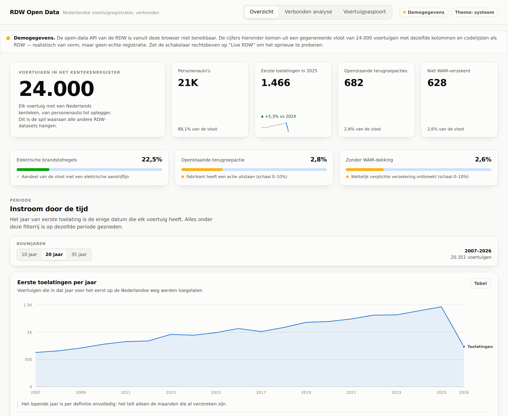

# RDW Open Data — a connected dashboard

A dashboard over the open data of the **RDW** (Rijksdienst voor het Wegverkeer), the
Dutch vehicle authority, published at [opendata.rdw.nl](https://opendata.rdw.nl).

The RDW publishes the Dutch vehicle register as a set of separate Socrata datasets:
one holds every licence plate, another the emissions, another the body type, another
every defect an inspector ever recorded at a periodic roadworthiness test (APK), and
another the statutory list that turns those defect codes into sentences. Socrata has
**no server-side join**, so on their own each dataset answers only a narrow question.

This dashboard's whole point is putting them back together. The interface is in Dutch,
because the data is.



## The three views

**Overzicht** — national aggregates. Every number here is computed by Socrata itself
via `$group`, so a headline figure is one request over the whole ~16-million-row
register rather than a download: first admissions per year, the marque leaderboard,
the fuel mix, vehicle type against build year as a heatmap, and meters for the
signals the register keeps (open manufacturer recalls, missing third-party
insurance).

**Verbonden analyse** — the join, made visible. It draws a cohort of licence plates
matching your filter, then hydrates it from the fuel, body and inspection datasets
with chunked `kenteken in (...)` queries, and computes every panel over the joined
rows. This is where facts appear that **no single dataset states**:

- *Plug-in hybrid* is not a value anywhere in RDW's data. It follows from two fuel
  rows on the same plate — petrol *and* electricity — and exists only after the join.
- CO₂ against kerb weight needs the mass from the register and the emissions from
  the fuel dataset.
- The defect leaderboard needs the inspection dataset for the codes and the statutory
  gebreken list to say what each code means.

**Voertuigpaspoort** — one licence plate resolved across six datasets in parallel:
specifications, emissions per fuel row, body, axles, vehicle class, and the full
inspection history with each defect code translated into its legal description.

## Running it

```bash
npm install
npm run dev            # http://localhost:5173
```

```bash
npm run check          # typecheck + tests + production build
npm run verify:datasets # check every RDW resource id and column against the live API

npm run build && npm run preview &
npm run screenshots     # refresh docs/overview.png and assert no view scrolls sideways
```

An optional Socrata app token lifts the anonymous rate limit. Copy `.env.example` to
`.env.local` and fill in `VITE_RDW_APP_TOKEN` — it identifies the application rather
than a user, so it is not a secret, but keep it out of version control.

### Live data and the demo fallback

The app opens against the live API and **falls back to generated demo data** if RDW
cannot be reached — a blocked network, an outage, a renamed resource. The fallback is
labelled in a banner and toggleable from the masthead, so a reader never mistakes
generated numbers for the register.

The demo backend is not a set of hand-written fixtures per panel. It is a small SoQL
evaluator (`src/mock/soqlEngine.ts`) running the *same queries* the live client
sends against a generated, RDW-shaped fleet (`src/mock/generate.ts`) — same column
names, same code lists, and the correlations the real fleet has. That means the
offline build exercises the real query paths, and a query bug cannot hide behind a
convenient fixture.

> **Note on the dataset registry.** This project was built in an environment with no
> outbound access to `opendata.rdw.nl`, so the resource identifiers and column names
> in `src/data/datasets.ts` were written from knowledge of the platform and **have
> not been confirmed against the live API**. Each entry records a `confidence` and
> whether it is `required`. Run `npm run verify:datasets` from a machine that can
> reach RDW before trusting a panel — it reports, per dataset, whether the resource
> resolves and whether every column the dashboard selects actually exists, and exits
> non-zero if a required dataset fails. Optional datasets that fail cost one card,
> not the page.

## How it is built

React + TypeScript on Vite, no chart library — the charts are hand-built SVG so the
mark specifications below can actually be met.

```
src/
  data/datasets.ts     the dataset registry: ids, columns, confidence
  data/queries.ts      every question asked of RDW, aggregate and joined
  lib/soql.ts          typed SoQL builder
  lib/dataSource.ts    live Socrata client + demo backend behind one contract
  lib/join.ts          chunked client-side joins across datasets
  lib/palette.ts       colour assignment rules
  charts/              line, bar, stacked column, scatter, heatmap, figures
  views/               the three views
  mock/                the demo fleet and the SoQL evaluator
```

### Joining, concretely

Socrata serves one dataset per request. One request per vehicle would be thousands of
requests; one request for thousands of plates would blow the URL limit. `lib/join.ts`
settles at **180 plates per request with four in flight**, which keeps each URL near
2 kB and stays well inside RDW's rate limit. Detail tables are one-to-many — a
plug-in hybrid has two fuel rows — so a join returns a `Map` of arrays, never a flat
row.

### Visual rules the charts follow

- **Categorical colour is assigned in a fixed, validated slot order and never
  cycled.** The order is the colourblind-safety mechanism, not decoration: it was
  checked in both themes (worst adjacent CVD ΔE 9.1 light / 8.4 dark against a ≥8
  target). Scatter uses the all-pairs pairlist, which caps this palette at three
  series, so the six powertrains fold into three buckets there.
- **Colour follows the entity, never its rank.** Diesel is slot 2 whether it is the
  largest bar or the smallest, so changing a filter never repaints the survivors.
- **Sequential means one hue, and it is re-anchored per theme.** Step 100 always means
  "nearest the surface, near zero" — the palest blue on the light theme, the deepest
  on the dark one. Dark mode is a selected set of steps, not an automatic inversion.
- **Marks stay thin.** Bars cap at 24px with a 4px rounded data end and a square
  baseline; lines are 2px; a 2px gap in the surface colour separates stacked
  segments, and a 2px surface ring keeps end dots legible where lines cross. No
  borders drawn around marks.
- **Every chart has a table-view twin**, a hover readout where the value leads and
  the label follows, and a legend whenever two or more series are on screen.
- **Labels are trimmed to their gutter, never clipped by it**, and the untrimmed text
  stays in the tooltip and the table view. Wide grids scroll inside their own
  container so the page body never scrolls sideways.
- **Refetch holds the previous render** at reduced opacity — no skeleton flash, no
  layout jump.

### Honesty about the numbers

Every card names the datasets it read and links to them. Where a view computes over a
sample rather than the whole register, it says so, and shows both the sample size and
how many vehicles match the filter in full. The current calendar year is flagged as
incomplete wherever it appears in a time series. Fully electric vehicles are recorded
at 0 g/km, so they are excluded from the CO₂-against-mass scatter — with the count of
what was excluded stated on the card, not silently dropped.

## Licence and attribution

The code here is yours to use. The data belongs to the RDW and is published as open
data; please keep the attribution on the cards intact if you reuse the visualisations.
